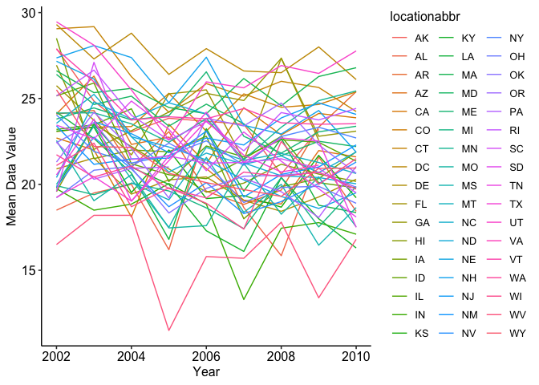
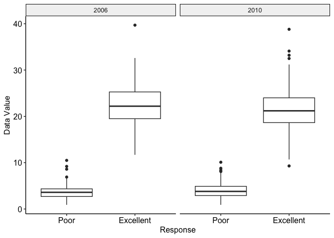

p8105_hw3_yq2378
================
Qi Yumeng
2023-10-07

``` r
library(p8105.datasets)
library(tidyverse)
```

    ## ── Attaching packages ─────────────────────────────────────── tidyverse 1.3.0 ──

    ## ✔ ggplot2 3.4.3     ✔ purrr   1.0.2
    ## ✔ tibble  3.2.1     ✔ dplyr   1.1.3
    ## ✔ tidyr   1.3.0     ✔ stringr 1.5.0
    ## ✔ readr   2.1.4     ✔ forcats 1.0.0

    ## ── Conflicts ────────────────────────────────────────── tidyverse_conflicts() ──
    ## ✖ dplyr::filter() masks stats::filter()
    ## ✖ dplyr::lag()    masks stats::lag()

``` r
library(ggpubr)
```

# Problem 1

``` r
data("instacart")
```

The data has 1384617 observations of 15 variables, where each row in the
dataset is a product from an order. `order_id` is order identifier.
`user_id` is customer identifier. `order_dow` is the day of the week on
which the order was placed. `order_hour_of_day` is the hour of the day
on which the order was placed. `product_name` is the name of the
product. `aisle` is the name of the aisle. `department` is the name of
the department. The following table gives a more detailed summary of the
variables.

``` r
skimr::skim(instacart) 
```

|                                                  |           |
|:-------------------------------------------------|:----------|
| Name                                             | instacart |
| Number of rows                                   | 1384617   |
| Number of columns                                | 15        |
| \_\_\_\_\_\_\_\_\_\_\_\_\_\_\_\_\_\_\_\_\_\_\_   |           |
| Column type frequency:                           |           |
| character                                        | 4         |
| numeric                                          | 11        |
| \_\_\_\_\_\_\_\_\_\_\_\_\_\_\_\_\_\_\_\_\_\_\_\_ |           |
| Group variables                                  | None      |

Data summary

**Variable type: character**

| skim_variable | n_missing | complete_rate | min | max | empty | n_unique | whitespace |
|:--------------|----------:|--------------:|----:|----:|------:|---------:|-----------:|
| eval_set      |         0 |             1 |   5 |   5 |     0 |        1 |          0 |
| product_name  |         0 |             1 |   3 | 159 |     0 |    39123 |          0 |
| aisle         |         0 |             1 |   3 |  29 |     0 |      134 |          0 |
| department    |         0 |             1 |   4 |  15 |     0 |       21 |          0 |

**Variable type: numeric**

| skim_variable          | n_missing | complete_rate |       mean |        sd |  p0 |    p25 |     p50 |     p75 |    p100 | hist  |
|:-----------------------|----------:|--------------:|-----------:|----------:|----:|-------:|--------:|--------:|--------:|:------|
| order_id               |         0 |             1 | 1706297.62 | 989732.65 |   1 | 843370 | 1701880 | 2568023 | 3421070 | ▇▇▇▇▇ |
| product_id             |         0 |             1 |   25556.24 |  14121.27 |   1 |  13380 |   25298 |   37940 |   49688 | ▆▆▇▆▇ |
| add_to_cart_order      |         0 |             1 |       8.76 |      7.42 |   1 |      3 |       7 |      12 |      80 | ▇▁▁▁▁ |
| reordered              |         0 |             1 |       0.60 |      0.49 |   0 |      0 |       1 |       1 |       1 | ▆▁▁▁▇ |
| user_id                |         0 |             1 |  103112.78 |  59487.15 |   1 |  51732 |  102933 |  154959 |  206209 | ▇▇▇▇▇ |
| order_number           |         0 |             1 |      17.09 |     16.61 |   4 |      6 |      11 |      21 |     100 | ▇▂▁▁▁ |
| order_dow              |         0 |             1 |       2.70 |      2.17 |   0 |      1 |       3 |       5 |       6 | ▇▂▂▂▆ |
| order_hour_of_day      |         0 |             1 |      13.58 |      4.24 |   0 |     10 |      14 |      17 |      23 | ▁▃▇▇▃ |
| days_since_prior_order |         0 |             1 |      17.07 |     10.43 |   0 |      7 |      15 |      30 |      30 | ▅▅▃▂▇ |
| aisle_id               |         0 |             1 |      71.30 |     38.10 |   1 |     31 |      83 |     107 |     134 | ▆▃▃▇▆ |
| department_id          |         0 |             1 |       9.84 |      6.29 |   1 |      4 |       8 |      16 |      21 | ▇▂▂▅▂ |

There are 134 unique aisles and fresh vegetables is the most items
ordered from. Fresh fruits comes the second and packaged vegetables
fruit comes the third.

``` r
instacart %>% group_by(aisle) %>% summarise(cnt = n()) %>% arrange(desc(cnt))
```

    ## # A tibble: 134 × 2
    ##    aisle                            cnt
    ##    <chr>                          <int>
    ##  1 fresh vegetables              150609
    ##  2 fresh fruits                  150473
    ##  3 packaged vegetables fruits     78493
    ##  4 yogurt                         55240
    ##  5 packaged cheese                41699
    ##  6 water seltzer sparkling water  36617
    ##  7 milk                           32644
    ##  8 chips pretzels                 31269
    ##  9 soy lactosefree                26240
    ## 10 bread                          23635
    ## # ℹ 124 more rows

Grouped the data by aisle and reorder the data by the number of items
ordered in each aisle, we could easily see that the number of fresh
vegetables and fruits are almost twice as that of packaged vegetables
fruits. The least popular items are dry pasta, oil vinegars and butter.

``` r
instacart %>% group_by(aisle) %>% summarise(cnt = n()) %>%  filter(cnt>10000) %>% 
  ggplot(aes(x = reorder(aisle, cnt), y = cnt))+ geom_bar(stat="identity") + coord_flip() +
  geom_text(aes(label = cnt, y = 5000), cex = 2, col ='white')+
  xlab("Aisle") + theme_pubclean()
```

<!-- -->

The three most popular items in “baking ingredients”, “dog food care”,
and “packaged vegetables fruits” were listed below. For packaged
vegetables, the hit products are Organic Baby Spinach, Organic
Raspberries and Organic Blueberries. For baking ingredients, the hit
products are Light Brown Sugar, Pure Baking Soda and Cane Sugar. For dog
food care, the hit products are Snack Sticks Chicken & Rice Recipe Dog
Treats, Organix Chicken & Brown Rice Recipe and Small Dog Biscuits

``` r
instacart %>% filter(aisle %in% c("baking ingredients","dog food care","packaged vegetables fruits")) %>% group_by(aisle,product_name) %>% summarise(cnt = n()) %>% arrange(desc(cnt)) %>% slice(1:3)%>% arrange(desc(cnt))
```

    ## `summarise()` has grouped output by 'aisle'. You can override using the
    ## `.groups` argument.

    ## # A tibble: 9 × 3
    ## # Groups:   aisle [3]
    ##   aisle                      product_name                                    cnt
    ##   <chr>                      <chr>                                         <int>
    ## 1 packaged vegetables fruits Organic Baby Spinach                           9784
    ## 2 packaged vegetables fruits Organic Raspberries                            5546
    ## 3 packaged vegetables fruits Organic Blueberries                            4966
    ## 4 baking ingredients         Light Brown Sugar                               499
    ## 5 baking ingredients         Pure Baking Soda                                387
    ## 6 baking ingredients         Cane Sugar                                      336
    ## 7 dog food care              Snack Sticks Chicken & Rice Recipe Dog Treats    30
    ## 8 dog food care              Organix Chicken & Brown Rice Recipe              28
    ## 9 dog food care              Small Dog Biscuits                               26

The table shows the mean hour of the day at which Pink Lady Apples and
Coffee Ice Cream are ordered on each day of the week. For Coffee Ice
Cream, the mean daily sales of Coffee Ice Cream is approximately 14.20
units. The highest daily sales occurred on Tuesday, with a value of
15.38 units. The lowest daily sales occurred on Friday, with a value of
12.26 units.As for Pink Lady Apples, the mean daily sales of Pink Lady
Apples is approximately 12.54 units. The highest daily sales occurred on
Wednesday, with a value of 14.25 units. The lowest daily sales occurred
on Monday, with a value of 11.36 units

``` r
instacart %>% filter(product_name %in% c("Pink Lady Apples","Coffee Ice Cream")) %>% group_by(order_dow,product_name) %>% summarise(mean_order_hour_of_day = round(mean(order_hour_of_day),2)) %>% pivot_wider(names_from = order_dow,values_from = mean_order_hour_of_day) %>% rename(Sun = "0", Mon = "1", Tue = "2", Wed = "3", Thu = "4",Fri = "5", Sat = "6")
```

    ## `summarise()` has grouped output by 'order_dow'. You can override using the
    ## `.groups` argument.

    ## # A tibble: 2 × 8
    ##   product_name       Sun   Mon   Tue   Wed   Thu   Fri   Sat
    ##   <chr>            <dbl> <dbl> <dbl> <dbl> <dbl> <dbl> <dbl>
    ## 1 Coffee Ice Cream  13.8  14.3  15.4  15.3  15.2  12.3  13.8
    ## 2 Pink Lady Apples  13.4  11.4  11.7  14.2  11.6  12.8  11.9

# Problem 2

Make a two-panel plot showing, for the years 2006, and 2010,
distribution of data_value for responses (“Poor” to “Excellent”) among
locations in NY State.

``` r
data("brfss_smart2010")
brfss_smart2010 = brfss_smart2010 %>% janitor::clean_names() %>% filter(topic == 'Overall Health' & response %in% c("Poor", "Excellent")) %>% 
  mutate(response = factor(response, levels = c("Poor","Excellent"), ordered = TRUE))
```

In 2002, 6 states, including PA, MA, NJ, CT, FL, NC were observed at 7
or more locations. In 2010, 14 states were left, including FL, NJ, TX,
CA, MD, NC, NE,WA, MA,NY,OH, Co, PA, SC were observed at 7 or more
locations. Details were listed below.

``` r
brfss_smart2010 %>% filter(year == 2002) %>% group_by(locationabbr) %>% summarise( cnt = n_distinct(locationdesc)) %>% arrange(desc(cnt))  %>% filter(cnt >= 7)
```

    ## # A tibble: 6 × 2
    ##   locationabbr   cnt
    ##   <chr>        <int>
    ## 1 PA              10
    ## 2 MA               8
    ## 3 NJ               8
    ## 4 CT               7
    ## 5 FL               7
    ## 6 NC               7

``` r
brfss_smart2010 %>% filter(year == 2010) %>% group_by(locationabbr) %>% summarise( cnt = n_distinct(locationdesc)) %>% arrange(desc(cnt))  %>% filter(cnt >= 7)
```

    ## # A tibble: 14 × 2
    ##    locationabbr   cnt
    ##    <chr>        <int>
    ##  1 FL              41
    ##  2 NJ              19
    ##  3 TX              16
    ##  4 CA              12
    ##  5 MD              12
    ##  6 NC              12
    ##  7 NE              10
    ##  8 WA              10
    ##  9 MA               9
    ## 10 NY               9
    ## 11 OH               8
    ## 12 CO               7
    ## 13 PA               7
    ## 14 SC               7

The dataset `brfss_smart_excellent` contains 443 observations of 3
variables. From 2002 to 2010, mean data value across 51 states were
presented by the “spaghetti” plot. Generally the lines were in a
decreasing trend.

Distributions of `data_value` in different year and of different
position is shown below.Clearly, for both 2006 and 2010, the Poor has
lower data value compared to the Excellence. The max value of the poor
never exceeds the Q1 of the Excellence. Rough little difference could be
detetced between 2006 and 2010.

``` r
brfss_smart_excellent = brfss_smart2010 %>% filter(response == "Excellent") %>% 
  group_by(year,locationabbr) %>% summarise(mean_data_value = mean(data_value))
```

    ## `summarise()` has grouped output by 'year'. You can override using the
    ## `.groups` argument.

``` r
brfss_smart_excellent %>% ggplot(aes(x = year, y = mean_data_value,group = locationabbr,col = locationabbr)) + 
  geom_line() + theme_pubr(legend = "right") + ylab("Mean Data Value") + xlab("Year")
```

<!-- -->

``` r
brfss_smart2010 %>% filter(year %in% c(2006,2010)) %>%
  ggplot(aes(x = response, y = data_value))+ geom_boxplot()+ facet_grid(cols = vars(year)) + theme_pubr() +
  xlab("Response") + ylab("Data Value")
```

<!-- -->
